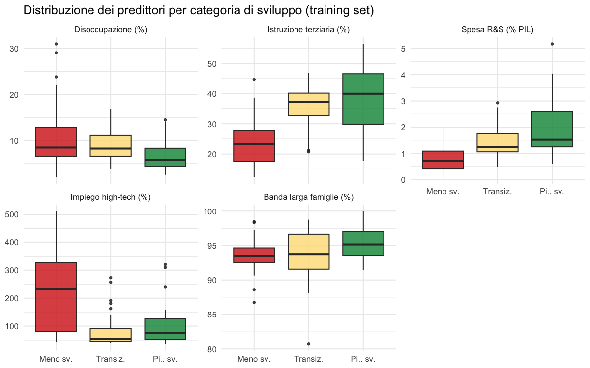
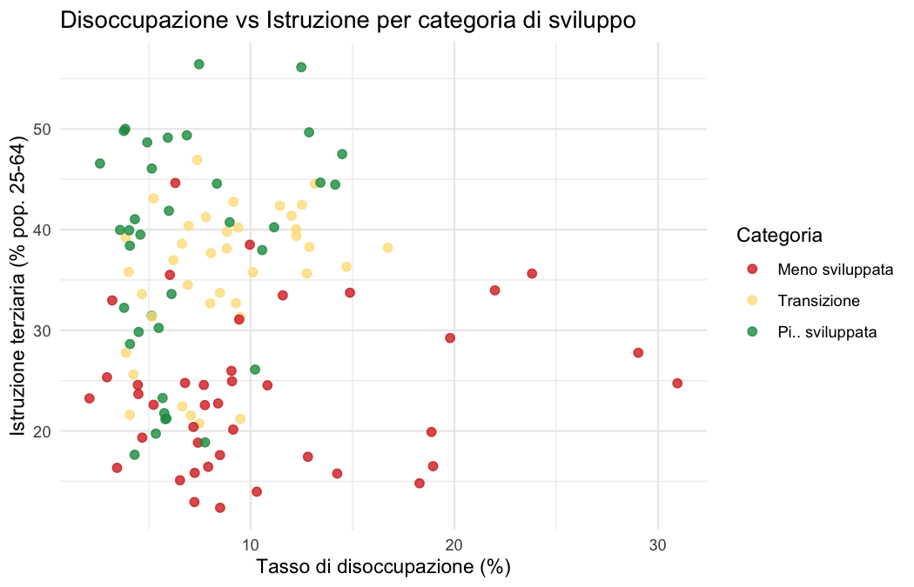
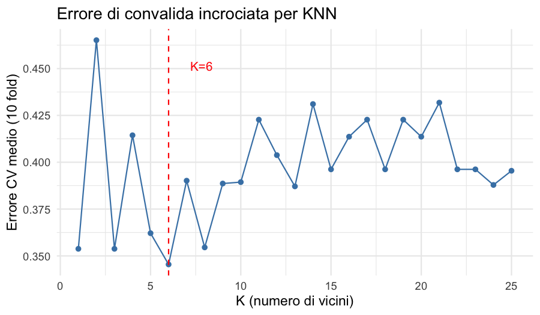
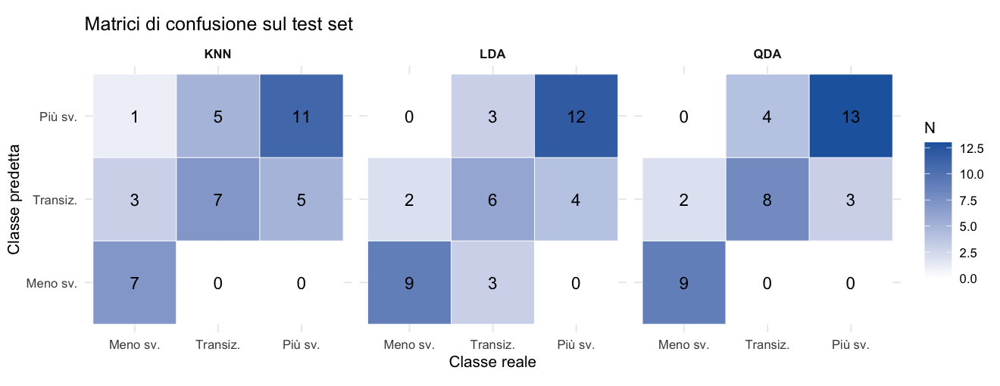
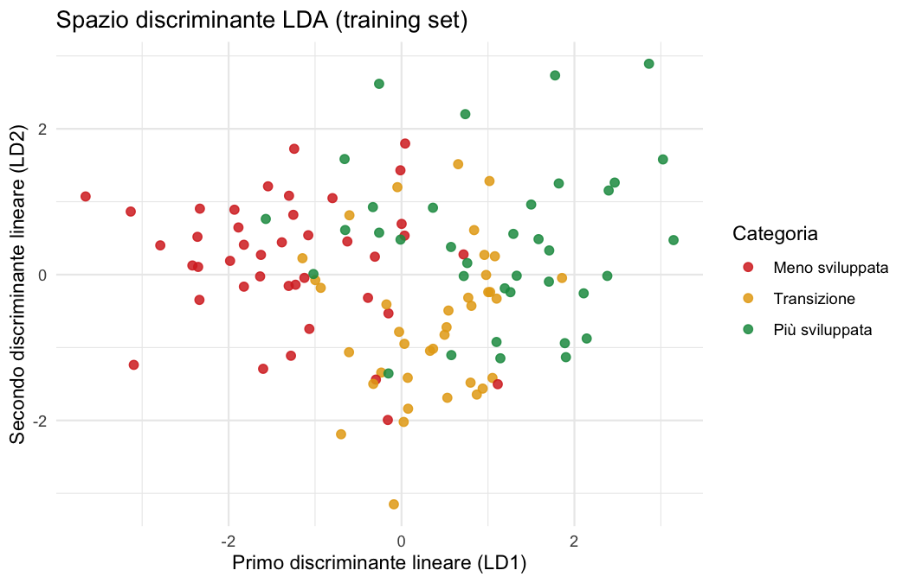

```{r setup, include=FALSE}
# Accenti puliti anche se R parte con locale "C" da terminale.
try(Sys.setlocale("LC_CTYPE", "en_US.UTF-8"), silent = TRUE)

knitr::opts_chunk$set(echo = FALSE, message = FALSE, warning = FALSE,
                      fig.align = "center", out.width = "95%")
library(dplyr); library(ggplot2); library(knitr); library(caret)
```

# Introduzione

La politica di coesione dell'UE classifica le regioni NUTS-2 in tre
categorie — *meno sviluppate*, *in transizione* e *più sviluppate* — in base
al PIL pro capite (PPS) rispetto alla media UE, e assegna i fondi strutturali
di conseguenza.

**Obiettivo.**

- **Predire** la categoria di sviluppo con indicatori diversi dal livello di PIL pro capite.
- **Confrontare** KNN, LDA e QDA sullo stesso training/test split.
- **Valutare** la capacità predittiva su regioni non usate nella stima.

**Fonte.** Dati **Eurostat**, anno 2021, livello NUTS-2, accessibili via API.
L'anno 2021 è usato perché, tra gli anni recenti controllati, è il più recente
con tutti gli indicatori disponibili nello stesso momento.

Dataset di partenza:

- **[tgs00006](https://ec.europa.eu/eurostat/databrowser/view/tgs00006/default/table?lang=en):** PIL pro capite PPS rispetto alla media UE; serve solo a definire la classe.
- **[tgs00010](https://ec.europa.eu/eurostat/databrowser/view/tgs00010/default/table?lang=en):** tasso di disoccupazione.
- **[tgs00109](https://ec.europa.eu/eurostat/databrowser/view/tgs00109/default/table?lang=en):** quota di popolazione adulta con istruzione terziaria.
- **[tgs00042](https://ec.europa.eu/eurostat/databrowser/view/tgs00042/default/table?lang=en):** spesa in R&S in percentuale del PIL.
- **[tgs00039](https://ec.europa.eu/eurostat/databrowser/view/tgs00039/default/table?lang=en):** occupazione nei settori high-tech, in percentuale degli occupati.
- **[isoc_r_broad_h](https://ec.europa.eu/eurostat/databrowser/view/isoc_r_broad_h/default/table?lang=en):** famiglie con accesso a banda larga.

Struttura dei dati:

- **Dataset raw:** ogni indicatore nasce come tabella Eurostat separata, filtrata su anno 2021 e regioni NUTS-2.
- **Unione:** le tabelle vengono unite con `inner_join` usando `geo`, il codice della regione.
- **Risposta da predire:** dal PIL pro capite PPS (`gdp_pps_pct`) si crea
  `dev_class`: sotto 75% = meno sviluppata, tra 75% e 100% = transizione,
  sopra 100% = più sviluppata.
- **Dataset finale:** una riga per regione, con `geo`, `country`, `region`,
  `dev_class` e i cinque predittori. Dopo aver creato la classe, il PIL viene
  escluso dai dati usati dai modelli.
- **Anni più recenti:** 2022, 2023, 2024 e 2025 non danno lo stesso dataset
  completo, perché manca almeno uno degli indicatori selezionati.

Il codice R completo è allegato come file separato (`R/01_load_data.R` – `R/04_evaluation.R`).

# I Dati

```{r load, results='hide'}
source("R/01_load_data.R")
train <- read.csv("data/regions_train.csv", stringsAsFactors = FALSE)
test  <- read.csv("data/regions_test.csv",  stringsAsFactors = FALSE)
lvls  <- c("meno_sviluppata","transizione","piu_sviluppata")
train$dev_class <- factor(train$dev_class, levels = lvls)
test$dev_class  <- factor(test$dev_class,  levels = lvls)
all_data <- rbind(train, test)
all_data$dev_class <- factor(all_data$dev_class, levels = lvls)
```

```{r var-table}
vars <- data.frame(
  Variabile   = c("`unemp_rate`","`educ_tertiary`","`rnd_gdp_pct`",
                  "`hitech_emp_pct`","`broadband_pct`"),
  Unita       = c("% forza lavoro","% pop. 25-64","% PIL","% occupati","% famiglie"),
  Descrizione = c("Tasso di disoccupazione","Istruzione terziaria",
                  "Spesa R\\&S","Occupazione high-tech","Accesso banda larga")
)
kable(vars, booktabs = TRUE, col.names = c("Variabile", "Unità", "Descrizione"),
      caption = "Predittori utilizzati (anno 2021, NUTS-2). Il PIL pro capite PPS definisce la classe e non è usato come predittore.")
```

Il dataset comprende:

- **`r nrow(all_data)` regioni NUTS-2** di 23 paesi UE.
- **Classi:** `r sum(all_data$dev_class=="meno_sviluppata")` meno sviluppate,
  `r sum(all_data$dev_class=="transizione")` in transizione,
  `r sum(all_data$dev_class=="piu_sviluppata")` più sviluppate.
- **Partizione:** 75% training (`r nrow(train)`) / 25% test
  (`r nrow(test)`). Nel codice il seed è fissato a `2026` per rendere
  riproducibile la divisione.

```{r desc-stats}
preds <- c("unemp_rate","educ_tertiary","rnd_gdp_pct","hitech_emp_pct","broadband_pct")
desc <- do.call(rbind, lapply(preds, function(v) {
  data.frame(
    Variabile = v,
    Meno_sv  = round(median(all_data[[v]][all_data$dev_class=="meno_sviluppata"], na.rm=TRUE),1),
    Transiz  = round(median(all_data[[v]][all_data$dev_class=="transizione"],     na.rm=TRUE),1),
    Piu_sv   = round(median(all_data[[v]][all_data$dev_class=="piu_sviluppata"],  na.rm=TRUE),1),
    check.names = FALSE
  )
}))
desc$Variabile <- c("Disoccupazione (%)","Educ. terziaria (%)","R\\&S (% PIL)",
                    "High-tech (% occupati)","Banda larga (%)")
kable(desc, booktabs = TRUE, escape = FALSE, row.names = FALSE,
      col.names = c("Variabile", "Meno sv.", "Transiz.", "Più sv."),
      caption = "Mediane dei predittori per categoria di sviluppo (dataset completo). La tabella confronta i valori centrali delle tre classi, senza assumere che ogni variabile separi bene tutte le categorie.")
```

Lettura delle mediane:

- **Istruzione, R&S e high-tech:** valori centrali più alti nelle regioni più sviluppate.
- **Banda larga:** differenze contenute, perché l'accesso è già alto in quasi tutte le regioni.
- **Disoccupazione:** più bassa nelle regioni più sviluppate, ma la transizione resta vicina alla classe meno sviluppata.

```{r eda, results='hide'}
source("R/02_eda.R")
```

```{r fig-box, fig.cap="Distribuzione dei predittori per categoria di sviluppo (training set). Il grafico confronta la distribuzione dei cinque predittori nelle tre classi: si vedono differenze nei valori mediani, ma anche sovrapposizione tra categorie.", fig.height=3.2}

```

**Lettura del grafico.** Istruzione terziaria, R&S e banda larga tendono a
crescere nelle classi più sviluppate, mentre la disoccupazione tende a essere
più bassa. Le scatole però si sovrappongono in tutte le variabili: nessun
predittore, da solo, separa perfettamente le tre classi.

```{r fig-scatter, out.width="70%", fig.cap="Disoccupazione vs istruzione terziaria per categoria. La separazione tra classi e parziale: le regioni meno sviluppate tendono verso disoccupazione piu alta e istruzione piu bassa, ma c'e sovrapposizione.", fig.height=3.0}

```

**Lettura del grafico.** Le regioni meno sviluppate si concentrano su bassa
istruzione e disoccupazione più alta; le più sviluppate hanno profilo opposto.
La classe di transizione resta nella zona centrale e si sovrappone alle altre.

# Metodi e Selezione del Modello

Vengono applicati tre classificatori:

- **KNN:** metodo non parametrico, basato sulle regioni più vicine.
- **LDA:** frontiere lineari e matrice di covarianza comune.
- **QDA:** frontiere quadratiche e covarianza stimata per classe.

Prima della classificazione:

- **Standardizzazione:** tutti i predittori sono portati a z-score.
- **Scelta di KNN:** si provano i valori `K = 1, ..., 25`.
- **CV:** convalida incrociata a 10 fold sul solo training set; i 10 fold sono
  i gruppi della CV, mentre `K` è il numero di vicini del KNN.
- **Test set:** usato solo alla fine, dopo aver scelto `K` e stimato i modelli,
  per misurare la previsione su dati non usati nelle decisioni precedenti.

```{r modeling, results='hide'}
source("R/03_modeling.R")
```

```{r eval-plots, results='hide'}
source("R/04_evaluation.R")
```

```{r fig-cv, out.width="65%", fig.cap="Errore CV a 10 fold per KNN al variare del numero di vicini. La curva non e monotona: oscilla tra i diversi valori di K; il valore scelto e indicato dalla linea rossa.", fig.height=2.8}

```

**Lettura del grafico.** La linea mostra l'errore medio di validazione per
ciascun numero di vicini. K=`r best_K` è scelto perché ha l'errore medio più basso,
anche se i valori vicini non seguono un andamento perfettamente regolare.

# Risultati

```{r comparison}
comp <- read.csv("output/model_comparison.csv")
test_n <- nrow(test)
best_correct <- round(max(comp$Accuratezza) * test_n)
baseline_acc <- max(table(test$dev_class)) / test_n
kable(comp, booktabs = TRUE, digits = 3,
      col.names = c("Modello","Accuratezza","Sensitività (macro)","Specificità (macro)"),
      caption = "Confronto dei classificatori sul test set (39 regioni). Metriche macro-mediate tra le tre classi.")
```

Dal confronto emerge che:

- **Miglior modello:** QDA, con accuratezza
  **`r round(max(comp$Accuratezza)*100,1)`%** sul test set
  (`r best_correct` regioni corrette su `r test_n`).
- **Confronto base:** scegliere sempre la classe più frequente del test avrebbe
  accuratezza circa **`r round(baseline_acc*100,1)`%**, quindi QDA migliora
  nettamente rispetto a una regola banale.
- **QDA:** usa frontiere quadratiche, quindi riesce a catturare una separazione
  meno lineare tra le classi.
- **LDA:** resta competitivo, ma la frontiera lineare perde alcuni casi della
  classe di transizione.
- **KNN:** più debole in 5 dimensioni con soli 116 casi di training.
- **Interpretazione:** le classi sono separabili, ma non in modo perfettamente
  lineare nello spazio degli indicatori strutturali.

```{r fig-cms, out.width='95%', fig.cap="Matrici di confusione sul test set per KNN, LDA e QDA. Ogni pannello confronta classe reale e classe predetta; i valori sulla diagonale sono le classificazioni corrette.", fig.height=3.2}

```

**Lettura del grafico.** La diagonale indica le classificazioni corrette. QDA
ha la diagonale più piena, soprattutto sulle classi estreme; gli errori si
concentrano ancora sulla transizione, che è la categoria più ambigua.

```{r fig-lda, out.width="72%", fig.cap="Spazio discriminante LDA (training set). LD1 separa le regioni meno sviluppate da quelle piu sviluppate; LD2 differenzia la classe di transizione.", fig.height=3.0}

```

**Lettura del grafico.** Nel piano LDA le regioni meno sviluppate e più
sviluppate occupano zone abbastanza distinte; le regioni in transizione stanno
più al centro. Questo aiuta a capire perché un modello più flessibile come QDA
può migliorare il risultato finale.

# Conclusioni

In sintesi:

- **Risultato principale:** QDA raggiunge un'accuratezza
  dell'**`r round(max(comp$Accuratezza)*100,1)`%** (`r best_correct`/`r test_n`)
  usando indicatori diversi dal PIL pro capite.
- **Lettura dell'accuratezza:** il valore è buono rispetto al baseline
  (`r round(baseline_acc*100,1)`%), ma va interpretato come risultato
  esplorativo perché il test set contiene solo `r test_n` regioni.
- **Classe critica:** la categoria *transizione* è la più difficile, perché
  condivide caratteristiche con entrambe le classi adiacenti.
- **Implicazione:** il modello può essere letto come indicazione esplorativa
  della convergenza reale tra regioni.
- **Limiti:** il campione è contenuto (`r nrow(all_data)` regioni), esclude
  aree con dati mancanti e fotografa un solo anno, il 2021.
